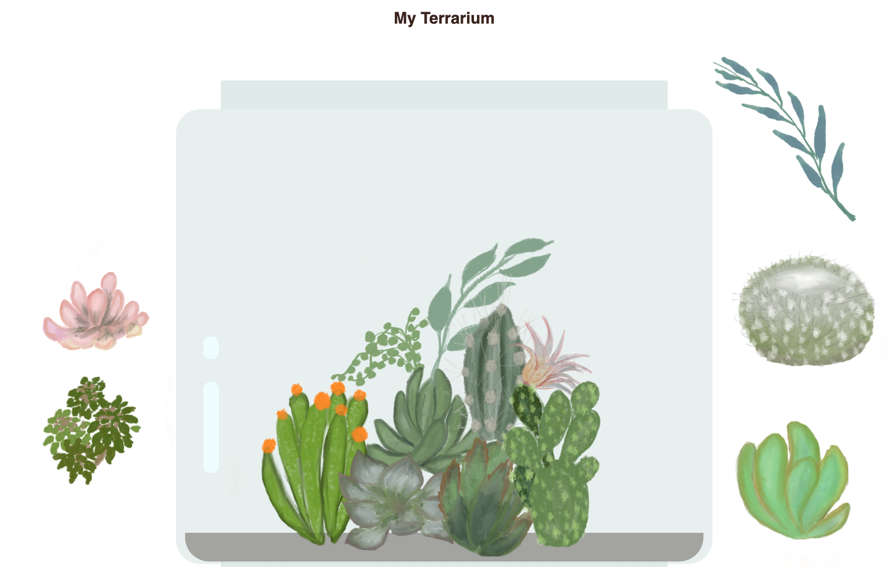
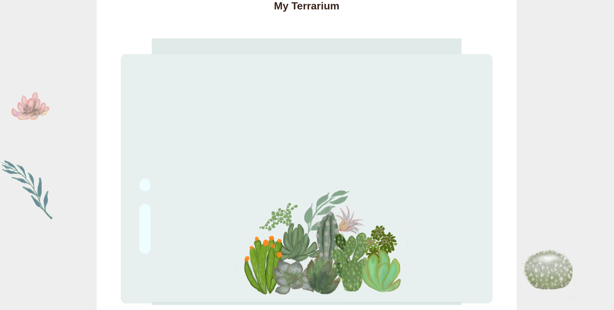

## My Terrarium: A project to learn about HTML, CSS, and DOM manipulation using JavaScript

A small drag and drop code-meditation. With a little HTML, JS and CSS, you can build a web interface, style it, and add an interaction.

### My solution

source: https://github.com/microsoft/Web-Dev-For-Beginners/tree/main/3-terrarium
